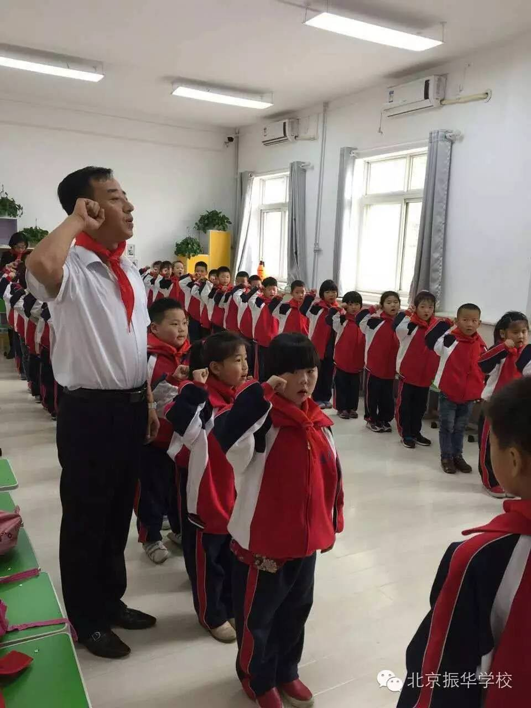
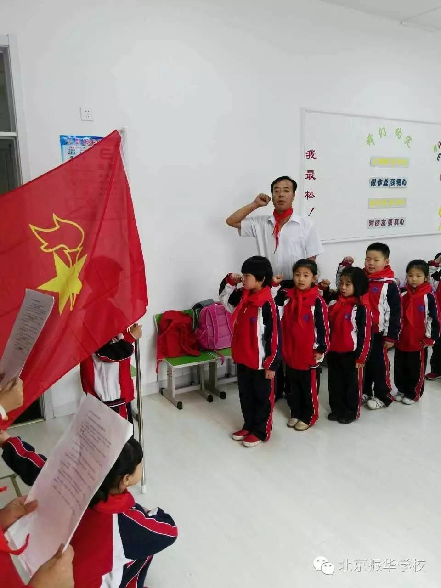
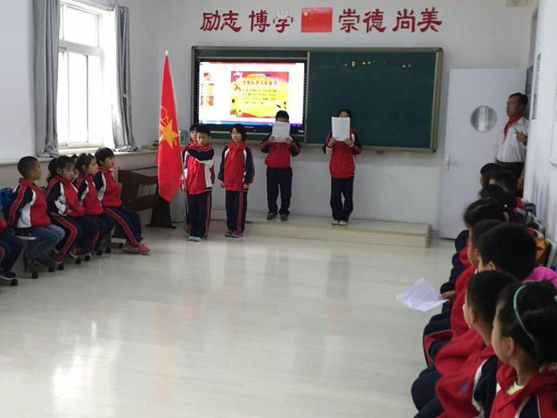

“我热爱中国共产党，热爱祖国，热爱人民，好好学习，好好锻炼，准备着：为共产主义事业，贡献力量。”一声声宏亮清脆的宣誓声响彻校园的上空，一只只紧握的拳头宣讲着最真挚的心，一片片鲜艳焯红的红领巾飘扬在每个人的胸前。

10月18日北京振华学校举行“红领巾与我们共成长”主题大会暨新队员入队仪式。出队旗、行队礼、唱队歌，宣布新队员名单，为新队员佩戴鲜艳的红领巾，入队仪式在大队辅导员周校长的主持下有序地进行。

新队员代表杨欣蕊在发言中表示，“我们一年级的小学生从今天开始成为光荣的少先队员了，今后，我们要向大哥哥和大姐姐学习，遵守纪律，好好学习，为队旗增添光彩。”

加入中国少年先锋，让鲜艳的红领巾飘扬在胸前，与我们共成长、共进步！入队仪式在热烈的掌声中徐徐落下帷幕，也在孩子们的心中播下力量的种子，织就光荣的少年中国梦。