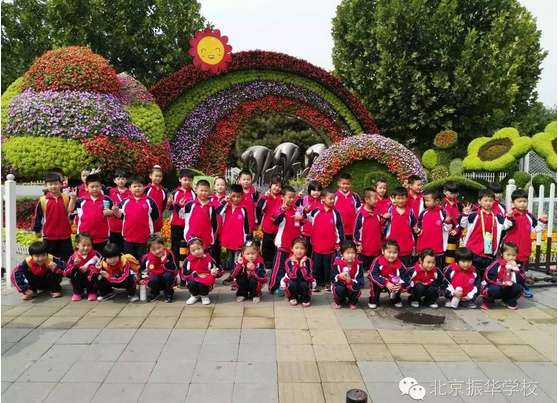
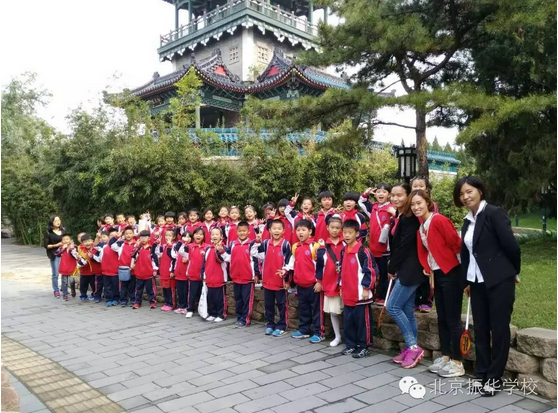
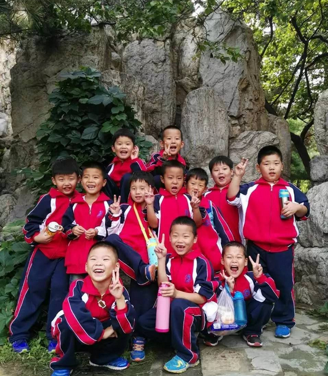
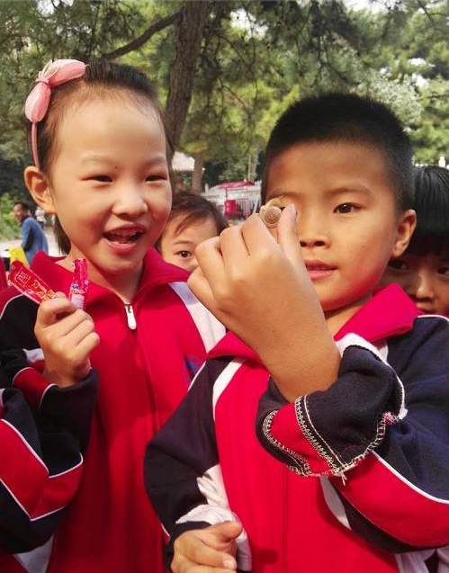

雨过天晴的太阳最美丽，瓜果飘香的初秋最迷人。今日，我校组织全体师生开展了一次“走进秋天、亲近自然”为主题的远足活动。一上午淅淅沥沥的秋雨打乱了孩子们迫不及待的心，在校午餐过后，天空放晴，同学们整理行装，整齐有序的向我们本次远足的目的地——昌平公园出发！

同学们一起背着小书包，手拉手，肩并肩，一路播撒欢笑，欣赏着沿途的秋日美景。时逢中秋佳节，路遇五彩缤纷的园艺设计景观，又是小草，又是小花，吸引着同学们的目光，牵住同学们的脚步。以此为背景，我们用相机留下这美好画面。

进入昌平公园，笔直秀气的白皮松、粗壮挺拔的柿子树、身姿婀娜的垂柳……通过看一看、摸一摸、比一比、说一说，同学们在老师的引导下，认识了不同形状和不同的树木。自然清新的大自然带给孩子们别样的视觉感受，秋季时节特有的风景一一呈现，有花木凋落残败，有果实成熟飘香，我们感受到孩子们对大自然强烈的好奇心。

这次远足实践活动使学生感受到了秋天的美好景色，培养了学生融入大自然，尊重大自然，爱护大自然的情怀，培养和加强了学生的团队精神和小组合作能力，增强了环保意识。

“千里之行，始于足下”希望孩子们从北京振华学校开始，迈出学习生涯坚实的第一步，北京振华学校与你同行！

