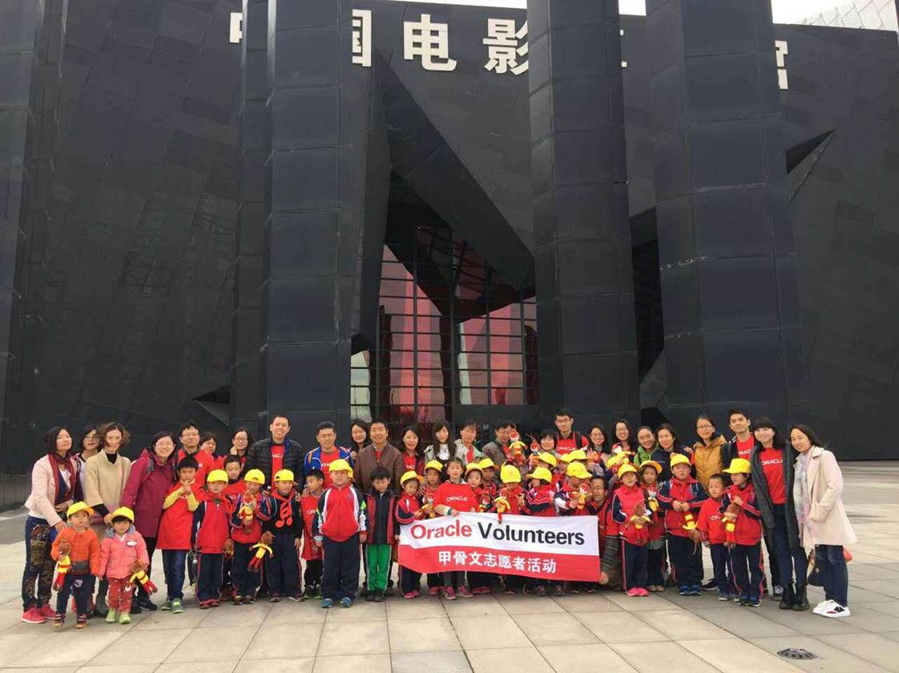
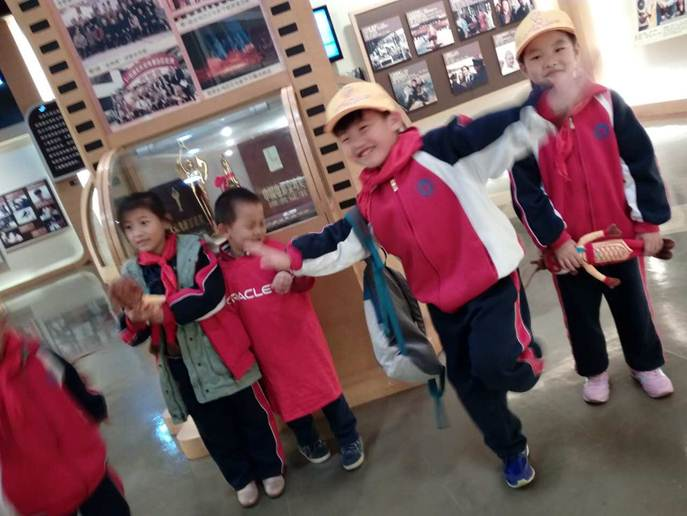
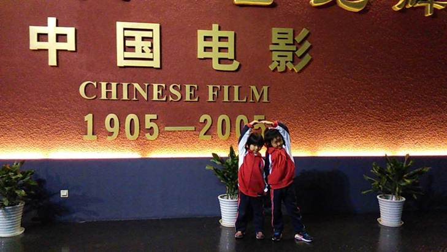
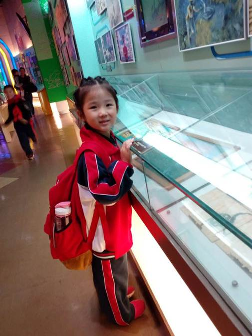
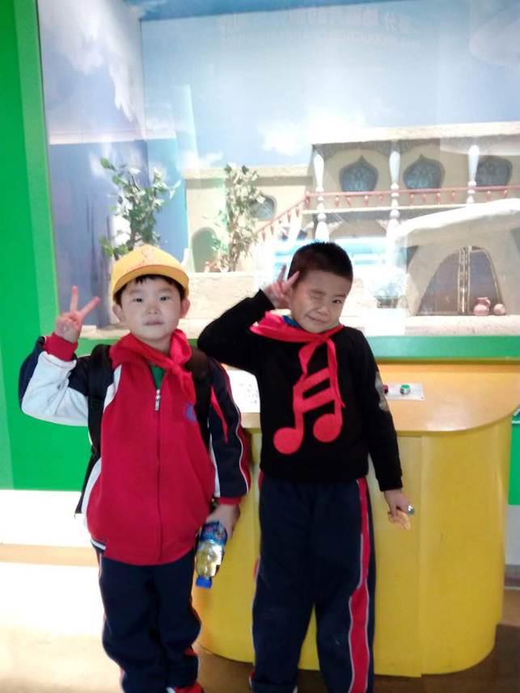
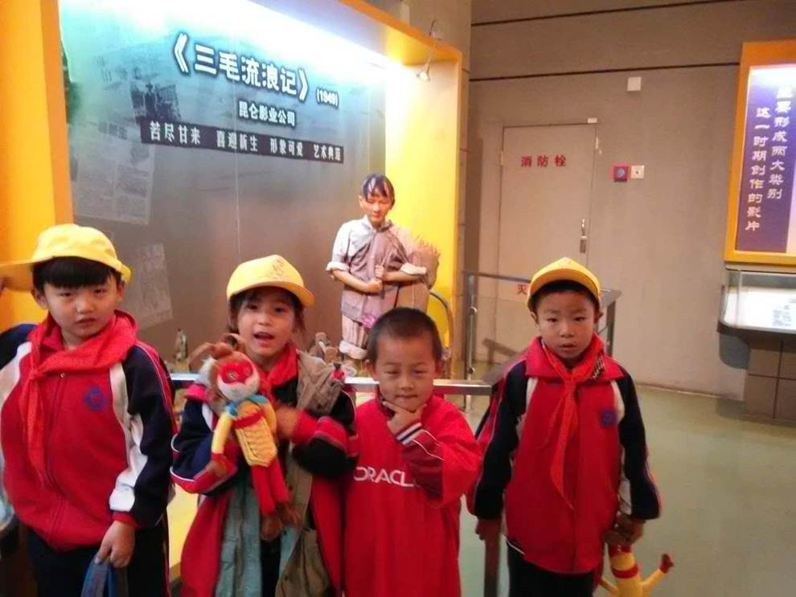
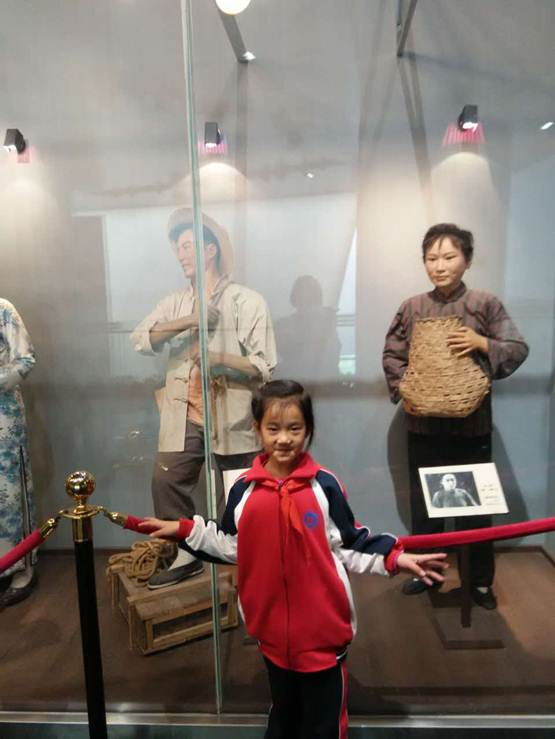
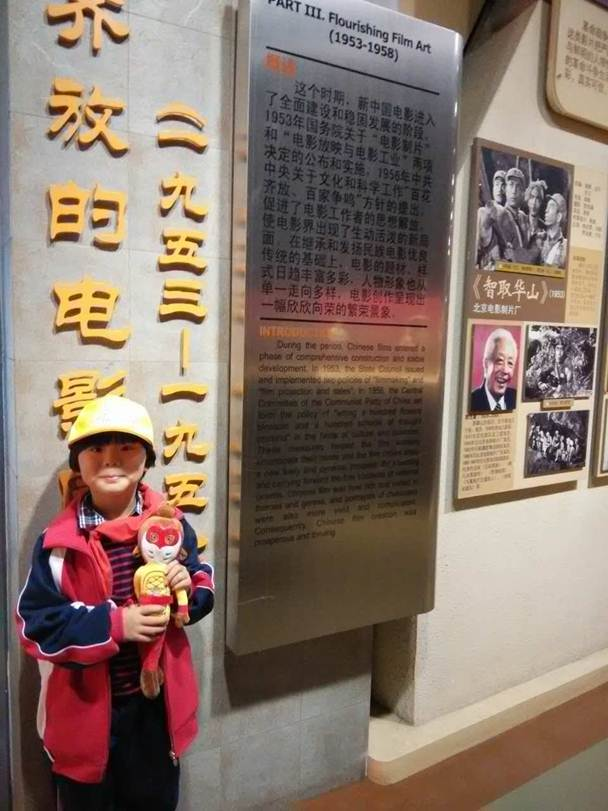

博物馆因其历史性、广博性、大众性被称为儿童阶段最适宜和灵活的历史、自然教科书，除却文字，让最直观最形象的事物冲击儿童眼球，以具体形象代替抽象模糊，让儿童从中获取知识。

本次，北京振华学校联合甲骨文中国公司志愿者，将中国电影博物馆作为博物馆类学习的首站地，让学生们畅游于电影发展历史的长河中，领略电影发展的神奇。

在每位志愿者的带领下，我们的一年级小同学不仅得到了全程无微不至的照顾，并在志愿者的带领下一步步踏上“电影奇妙之旅”。

中国电影博物馆共有4层，进门第一层是电影放映厅，会定期放映影片。每个展厅都有一个主题，一个上午的时间，同学们对中国电影的发展历程、各种电影类型、电影拍摄手法和中国电影新老演员等来了个全面的了解。其中，动画片展厅和特效展厅最受同学们的欢迎，进进出出三四次都还是意犹未尽。

想要参加开阔视野提高自己的认识吗？想和国际企业朋友学习吗？来北京振华学校，各种博物馆之行等着你！