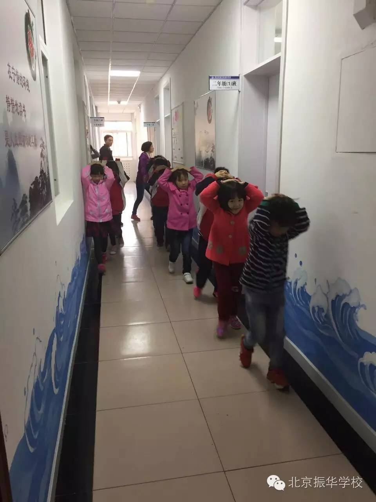
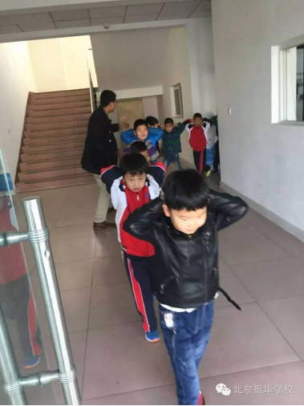
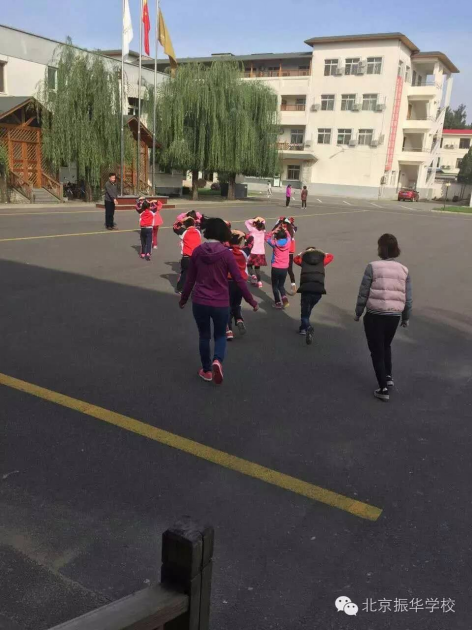

消防演习

北京市昌平学校以防震应急演练为契机创平安稳定校园为增强学生的防震减灾意识，锻炼应对地震等自然灾害的技能，我校于2016年10月12日上午开展了应急避震疏散演练活动。

在演习之前，各班班主任就地震灾害发生时的自救常识对学生进行了安全教育。上午9时左右，一声急促的警报声在校内响起，各班学生分别从各自的教室迅速有序地按预定疏散路线撤出到该校的操场上。在疏散过程中，各楼梯口都有监护人员随时救护，以防学生在疏散过程中跌倒、踩踏，保证其安全撤离。整个演练活动井然有序，学生之间没有出现推、拉、挤等现象。

防震应急演练是学校维护校园安全稳定，保障师生的人身安全和财物安全的一项重要工作，多年来，学校始终把校园安全稳定作为管理工作的重点，在校领导的高度重视下，教职工齐心协力，齐抓共管，有效落实各项安全防护措施。

加强师生思想教育，确保认识到位。学校领导班子将安全作为重中之重，学校组织各班宣传教育，把安全的重要性带进每一个班级、每一个宿舍，把隐患的危害告知每一学生，让学生从思想上认识，从行动中留心，从判断中醒悟，避免危害伤及师生。

安全宣传多样化，日常教育常态化。加大宣传力度，充分利用学校宣传板栏，针对校园易发的事件做好对师生的宣传教育，引导师生对防火、防盗、交通安全、突发事件的防范和处置。加大宣传力度，深入宿舍、深入班级，不厌其烦教育和引导学生有效做好人身安全及财物安全防范。利用教职工大会，强调和引导各班加强内部管理，有效做好全校人员的安全防范工作。