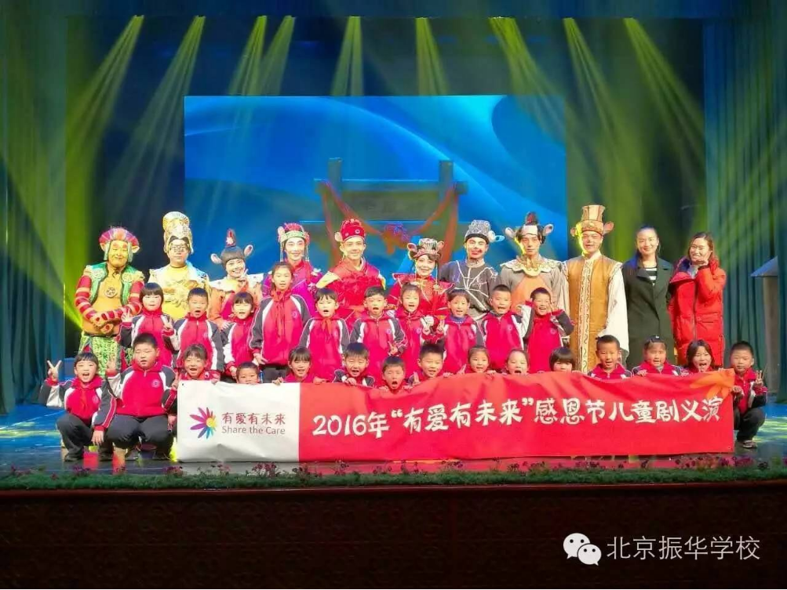
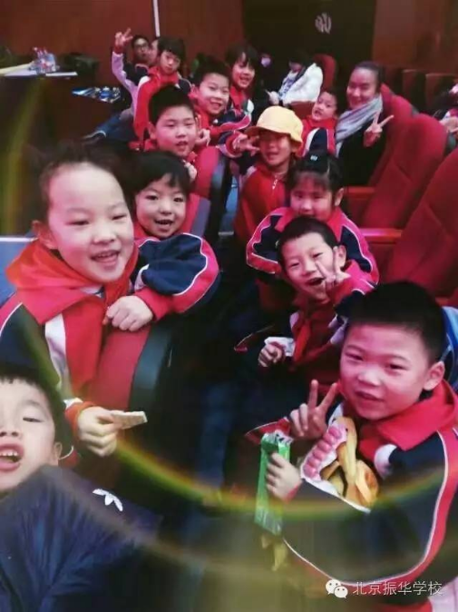
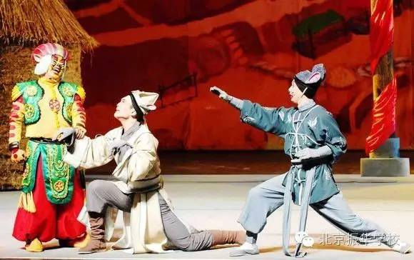
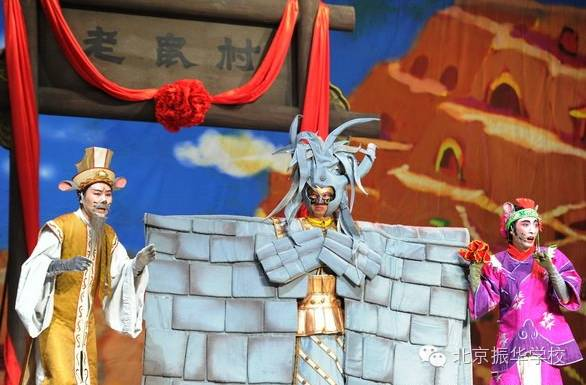
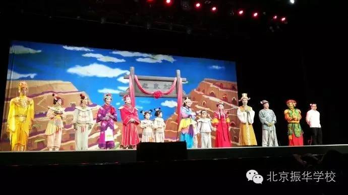

恰逢一年感恩节，恰逢一种感恩心。在这样一个节日中，振华学校组织全校师生参赏2016“有爱有未来”感恩节儿童剧演出——《老鼠招亲记》。

老鼠村里美丽的聪明的老鼠小雪向全宇宙发出了招亲邀请啦！同学们快快一起来围观吧！

话剧气氛一会儿欢快,一会儿热闹，一会儿滑稽,一会儿紧张。剧情逗引的小观众们一会儿哈哈大笑,一会儿紧张尖叫，简直不能自已。

说到话剧，这可是一项集表演能力、心理素质、语言表达等的综合性艺术。她从西方走来，在中国大地上绽放光彩，融合东方文化内容和西方话剧形式，一场真正的中西合璧。振华学校也在加紧演练我们自己的英语话剧哦，至于主题是什么，那我要保密了。等到演出的那天，欢迎你来观振华学校同学们带来的话剧表演。

